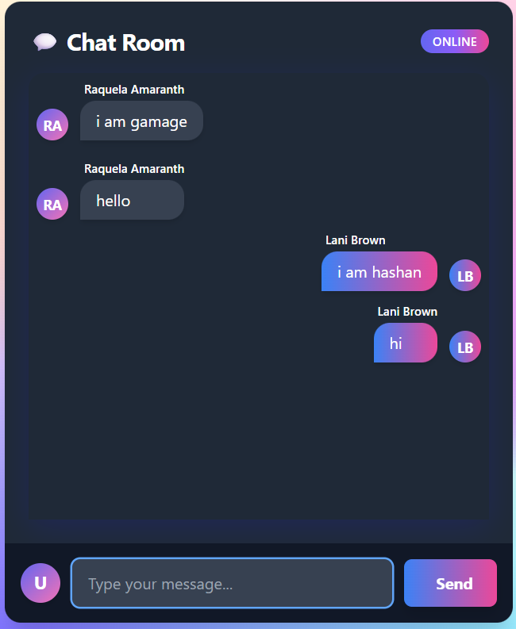

# 🚀 Real-Time Chat Application with Socket.IO

A modern, full-stack real-time chat application built with **Node.js**, **Express**, **Socket.IO**, and an elegant frontend (HTML/CSS/Tailwind or React). Instantly send and receive messages across multiple clients—no refresh required!

---

## ✨ Features

- Real-time messaging with Socket.IO
- Unique usernames for each user
- Message history (in-memory or database-backed)
- Responsive, modern chat UI
- User avatars and message bubbles
- Typing indicator (optional)
- Room support (optional)

---

## 🛠️ Tech Stack

- **Backend:** Node.js, Express, Socket.IO
- **Frontend:** HTML, CSS (Tailwind CSS), JavaScript (or React)
- **Database:** (Optional) MongoDB or PostgreSQL for message persistence

---

## 🚦 Getting Started

### 1. **Clone the Repository**

```bash
git clone https://github.com/your-username/socketio-chat-app.git
cd socketio-chat-app
```

### 2. **Install Dependencies**

```bash
npm install
```

### 3. **Start the Server**

```bash
npm run serve
```

By default, the server runs on [http://localhost:3000](http://localhost:3000).

### 4. **Open the Chat App**

Open your browser and go to [http://localhost:3000](http://localhost:3000).  
Open multiple tabs or devices to see real-time messaging in action!

---

## 🖥️ Project Structure

```
.
├── backend/
│   ├── server.js
│   └── ... (models, routes, etc.)
├── frontend/
│   ├── index.html
│   ├── script.js
│   └── styles.css
├── package.json
└── README.md
```

---

## ⚡ Usage

- Type a message and press **Send** (or hit Enter).
- Messages appear instantly for all connected users.
- Each user is assigned a unique username and avatar.
- (Optional) Join different chat rooms.

---

## 📝 Customization

- **Persistence:** Connect to MongoDB/PostgreSQL for saving messages.
- **Authentication:** Add user login/registration.
- **UI:** Customize with your favorite CSS framework or use React/Vue.

---

## 🛡️ Security Notes

- Always validate and sanitize user input.
- Use HTTPS in production.
- Consider authentication and rate limiting for public deployments.

---

## 📸 Screenshots



Contributions are welcome!  
Feel free to open issues or submit pull requests.

---

## 📄 License

This project is licensed under the [MIT License](LICENSE).

---

## 🙏 Acknowledgements

- [Socket.IO Documentation](https://socket.io/docs/)
- [Tailwind CSS](https://tailwindcss.com/)
- [Express.js](https://expressjs.com/)

---

**Happy chatting! 🚀**

---